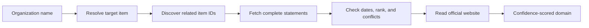

# Wikidata domain discovery

The Wikidata plugin finds domains published for an organization's subsidiaries. It treats Wikidata as a source of reviewable leads, not proof of ownership: corporate records can be stale, incomplete, or contradictory.

## How it works

1. **Resolve the organization.** Search results are checked against labels, aliases, and official names. A supplied domain is a strong disambiguator. If the best match is tied, the plugin returns nothing rather than choosing an arbitrary Wikidata item.
2. **Find possible subsidiaries.** Two small SPARQL queries look in both directions:
   - the target lists the candidate as a subsidiary (`P355`)
   - the candidate lists the target as its parent organization (`P749`)
3. **Fetch the evidence.** The plugin retrieves complete statements for the target and candidates, including ranks, date qualifiers, and references.
4. **Evaluate locally.** Deprecated and future relationships are not emitted. Ended relationships are retained at low confidence for review. Claims are also checked for a different current parent (`P749`) or owner (`P127`).
5. **Extract domains.** A candidate must have a current official website (`P856`). The URL is reduced to its hostname and duplicate domains are resolved deterministically.

## Corroboration and confidence

A usable relationship starts at **40** confidence. The score increases when Wikidata provides corroborating evidence:

| Evidence | Score |
|---|---:|
| Current subsidiary or parent relationship | 40 |
| Relationship has a source URL (`P854`) or stated source (`P248`) | +5 |
| Relationship appears in both directions (`P355` and `P749`) | +10 |
| Official website statement has a source | +5 |

The score is capped at **60**. A current parent or owner other than the target lowers it to **0**; an unreconciled ended claim with no other current affiliation lowers it to **10**. Wikidata-only findings therefore remain below Pius's high-confidence threshold and require review.

Dates come from start time (`P580`) and end time (`P582`). A missing end date means "open-ended," not confirmed current ownership; the justification says this explicitly.

## Endpoints

The plugin deliberately splits work between two public Wikidata endpoints:

- **`https://www.wikidata.org/w/api.php`**
  - `wbsearchentities` resolves the organization name.
  - `wbgetentities` fetches labels and complete claims in batches of up to 50 items.
  - This API is the efficient way to retrieve statement ranks, qualifiers, and references.
- **`https://query.wikidata.org/sparql`**
  - Used only for the two reverse relationship lookups, capped at 500 candidates each.
  - SPARQL is needed to discover items that point to the target, but broad statement queries are avoided because they are slower and more likely to be rate-limited.

Completed findings use Pius's 24-hour Wikidata cache. Transient `429` and `5xx` responses are retried up to three times; malformed or incomplete evidence does not produce a finding.
